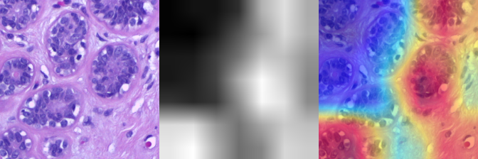

# Explainable AI for Cancer Detection in Histopathology

This project applies **Grad-CAM (Gradient-weighted Class Activation Mapping)** to a **ResNet-50** model trained for **binary classification** of histopathological images (cancerous vs. non-cancerous). The main goal is to enhance the interpretability and trustworthiness of deep learning predictions in medical imaging, allowing clinicians to visually verify what the model "sees" as evidence for cancer.

## 🧠 Overview

Deep convolutional neural networks have demonstrated remarkable accuracy in detecting cancer from histopathology images. However, their complex decision-making process is often perceived as a "black box," limiting their clinical adoption. To tackle this challenge, **Grad-CAM** provides an intuitive, visual explanation by highlighting the regions in the tissue sample that most strongly influenced the model's prediction.

By generating a heatmap overlay on the original image, Grad-CAM guides pathologists and researchers to understand **which tissue patches contribute the most to the classification**, facilitating model validation, error analysis, and potentially uncovering novel biomarkers.

## 🔬 Model Details

- **Architecture**: ResNet-50, a deep residual network known for powerful feature extraction.
- **Task**: Binary classification to distinguish cancerous tissue patches from normal tissue.
- **Explainability**: Grad-CAM applied to the last convolutional layer for interpretable visual explanations.

Grad-CAM works by computing the gradients of the output class score with respect to the feature maps in the last convolutional layer. These gradients are pooled to weigh the importance of each feature map channel. The weighted sum produces a localization heatmap showing **the spatial regions most influential in the model's decision**.

---

## 📷 Visualization Example

**Original Tumor Patch** | **Grad-CAM Grayscale Map** | **Grad-CAM Heatmap Overlay**
---

For more information on Grad-CAM, see the original paper:  
[Selvaraju et al., 2017 — Grad-CAM: Visual Explanations from Deep Networks via Gradient-based Localization](https://arxiv.org/abs/1610.02391)
